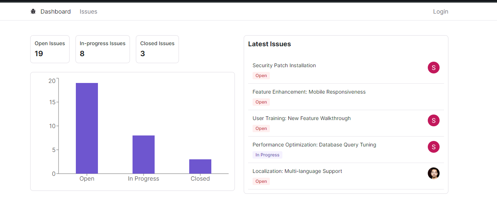
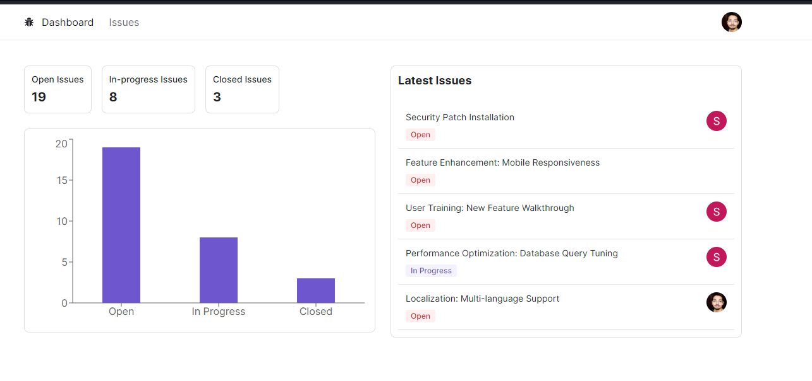
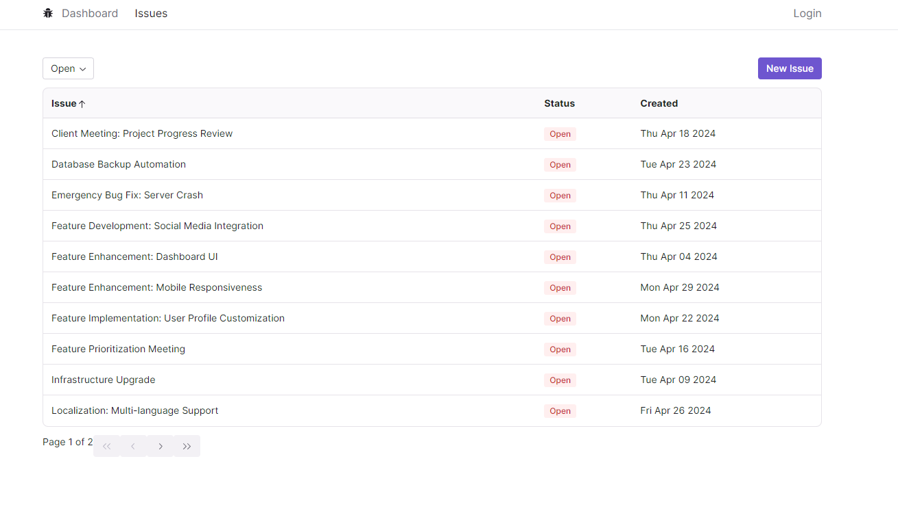
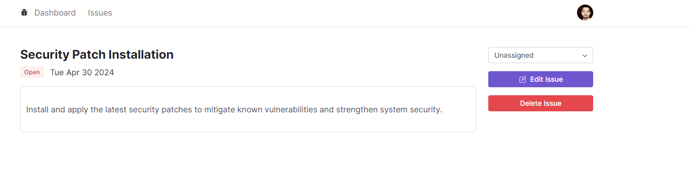
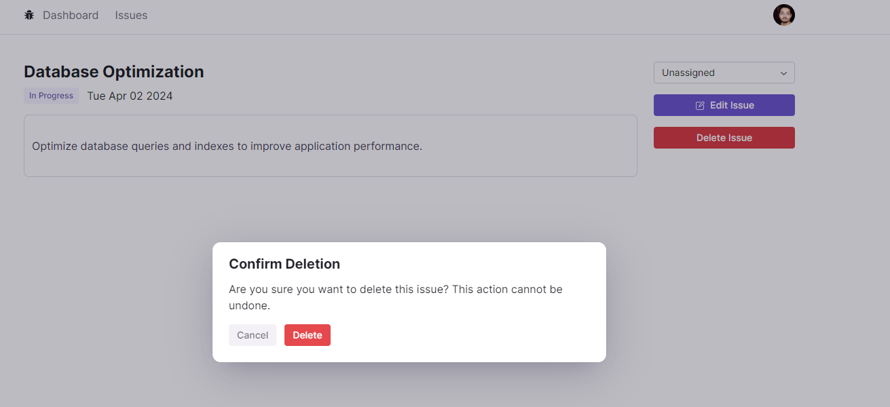
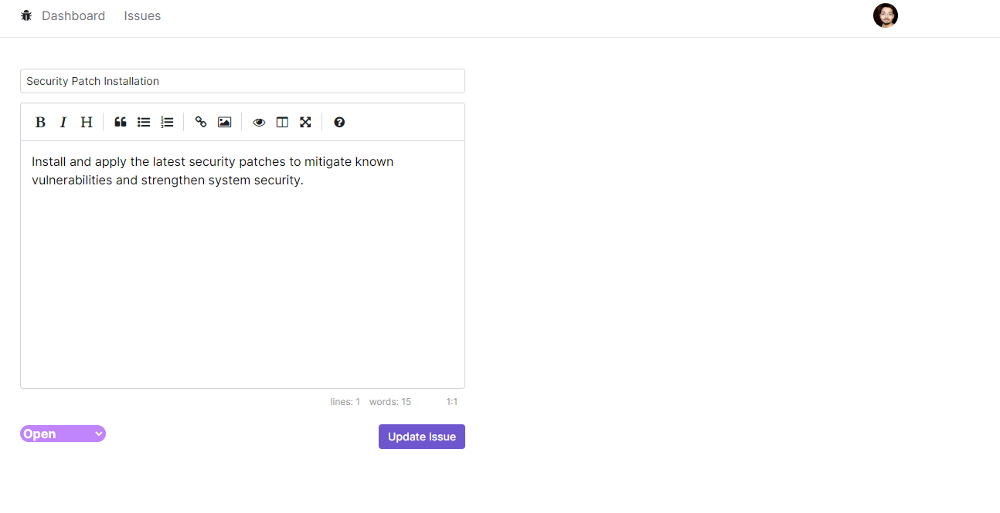

## Getting Started


 https://issue-tracker-umber-delta.vercel.app/

First, run the development server:

```bash
npm run dev
# or
yarn dev
# or
pnpm dev
```

Open [http://localhost:3000](http://localhost:3000) with your browser to see the result.

You can start editing the page by modifying `app/page.tsx`. The page auto-updates as you edit the file.

This project uses [`next/font`](https://nextjs.org/docs/basic-features/font-optimization) to automatically optimize and load Inter, a custom Google Font.


The user will land on the dashboard, where he may view the most recent issues produced or assigned to someone, as well as data via the graph, such as the number of issues that are open, in progress, or completed. Though he won't be able to edit, add a new problem, or designate it to someone, he will still be able to see the issues. By clicking on it, the user may also sort by issue, status, or creation. 

Hello everyone Issue Tracker  that allows users to log in using Google permission. The user may add new issues to the issue tracker, update existing ones, and assign tasks to other users after checking in using Google OAuth.

looking for your suggestion to add some feature based on requirement.








